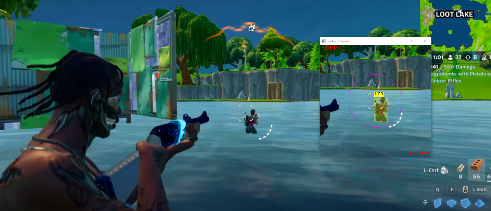

# Lunar V3

Welcome to the official repository for Lunar V3, the next evolution in neural network aim assist technology. Lunar V3 represents a groundbreaking advancement in real-time object detection for FPS games, offering unparalleled performance and accuracy.

## About Lunar V3

Lunar V3 is not just an upgrade; it's a complete overhaul of the popular Lunar neural network aim assist tool. Developed from scratch in C++, this version leverages a custom dataset of over 10,000+ meticulously curated images, ensuring unmatched precision in player detection.

### Key Features

- **Advanced Object Detection**: At the core of Lunar V3 is a state-of-the-art YOLO (You Only Look Once) version, which remains our trade secret. This version significantly outperforms its predecessors in both speed and accuracy.
- **Optimized for Performance**: Written entirely in C++, Lunar V3 is optimized for efficiency, offering blazing-fast detection speeds that are essential in high-paced gaming environments.
- **Custom Dataset**: Our unique dataset, comprising over 10,000 images, has been specifically tailored to provide superior recognition capabilities in a variety of gaming scenarios.
- **Versatility**: While currently fine-tuned for Fortnite, Lunar V3's architecture allows for easy adaptation to other FPS games, making it a versatile tool for gamers.
- **User Privacy and Safety**: Lunar V3 operates with the utmost respect for user privacy and system integrity. It does not interfere with the memory of other processes, ensuring a safe and secure gaming experience.

## Demo and Usage

For a glimpse into Lunar V3's capabilities, please visit our [demo page](https://www.youtube.com/watch?v=N53yuC2_gxs).

Due to the advanced nature of this tool, Lunar V3 is a paid product. To access the software and detailed usage instructions, please contact us directly.

## Contact and Purchase

To inquire about purchasing Lunar V3, please join our Discord community: [Lunar V3 Discord](https://www.pythonp.xyz/discord).

For detailed inquiries, feel free to contact us at [Lunar V3 Discord](https://www.pythonp.xyz/discord).

## Disclaimer

Lunar V3 is developed for educational and research purposes. We do not endorse or promote its use for unfair advantage in competitive gaming scenarios. Users are advised to adhere to the terms of service and rules of the respective games they play.

